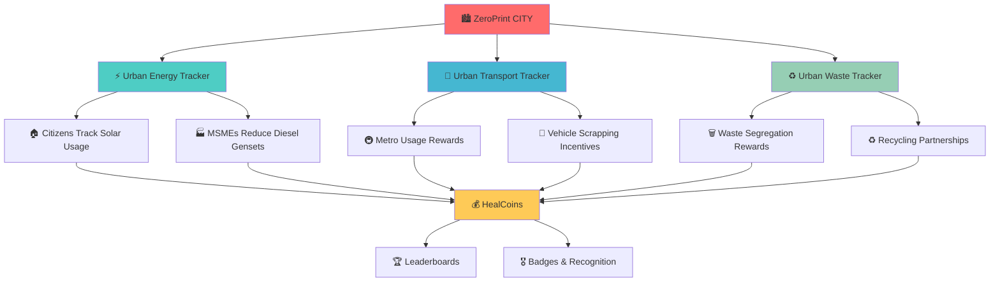
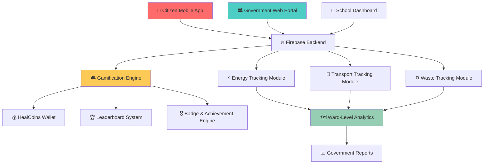
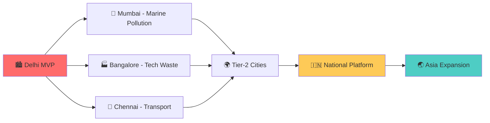

# 🏙️ ZeroPrint CITY
### *Transforming Delhi from Pollution Capital to Clean Air Champion*

<div align="center">

[](https://city.zeroprint.ai)
[](https://city.zeroprint.ai/aqi)
[](https://gov.zeroprint.ai)
[](https://city.zeroprint.ai/citizens)


**🚨 BREAKING THE POLLUTION CRISIS 🚨**  
*From Smog Capital to Smart City - One Citizen Action at a Time*

[🏛️ Government Portal](https://gov.zeroprint.ai) • [📱 Citizen App](https://app.city.zeroprint.ai) • [🏫 School Dashboard](https://schools.city.zeroprint.ai) • [🏭 MSME Portal](https://msme.city.zeroprint.ai)

</div>

---

## 🔥 **The Delhi Crisis That Demands Action**

<div align="center">

### 📊 **The Harsh Reality**

| Crisis Factor | Current Impact | Annual Cost |
|---------------|----------------|-------------|
| 🌫️ **Winter Smog** | Schools closed 40+ days | ₹2,000 Cr lost productivity |
| 🚗 **Vehicle Pollution** | 20+ year old diesels running | 60% of air pollution |
| ⚡ **Dirty Energy** | Diesel gensets everywhere | 25% energy from fossil |
| 🗑️ **Burning Landfills** | 3 giant dumps on fire | <20% waste segregation |

</div>

> **Every winter, Delhi becomes unlivable. Courts intervene. Politicians blame each other. Citizens feel helpless.**  
> **It's time for TECHNOLOGY to solve what POLICY couldn't.**

---

## 🌟 **ZeroPrint CITY - The Game Changer**

### 🎯 **The Revolutionary Approach**
Instead of MORE penalties and restrictions, we're building the first **gamified urban sustainability platform** that rewards citizens for cleaning their own city.

<table>
<tr>
<td width="50%" align="center">

### ❌ **Old Way (Doesn't Work)**
- Fines and penalties
- Top-down enforcement
- Citizens feel powerless
- Politicians fight each other
- No real-time data
- No incentive to change

</td>
<td width="50%" align="center">

### ✅ **ZeroPrint Way (Revolutionary)**
- Rewards and gamification
- Bottom-up citizen action
- Empowered communities
- Data-driven governance
- Real-time impact tracking
- HealCoins for good behavior

</td>
</tr>
</table>

---

## 🚀 **Three Pillars to Save Delhi**

<div align="center">



</div>

---

## 🎮 **Core Modules - Making Sustainability Addictive**

### ⚡ **Urban Energy Tracker**
*From Diesel Gensets to Solar Champions*

<div align="center">

| User Type | Input | Smart Analysis | Rewards |
|-----------|-------|----------------|---------|
| 🏠 **Citizens** | Monthly electricity bill | Clean vs dirty energy % | 2x HealCoins for solar usage |
| 🏭 **MSMEs** | Grid + genset consumption | Sustainability score | Bonus coins for genset reduction |
| 🏛️ **Government** | Ward-level aggregation | Policy impact simulation | Public recognition programs |

</div>

**Real Impact**: *Ward-level heat map showing which areas are leading the clean energy revolution*

### 🚗 **Urban Transport Tracker**
*Every Trip Counts Towards Clean Air*

#### 🎯 **Smart CO₂ Calculator**
```
🚗 Petrol Car (10km) → 2.3 kg CO₂ → 0 HealCoins
🚇 Delhi Metro (10km) → 0.5 kg CO₂ → 15 HealCoins  
🚌 CNG Bus (10km) → 0.8 kg CO₂ → 10 HealCoins
🛴 Electric Scooter (10km) → 0.2 kg CO₂ → 20 HealCoins
```

#### 🏆 **Transport Achievements**
- 🚇 **Metro Hero**: 10+ metro trips logged
- 🔋 **EV Pioneer**: 25+ electric vehicle trips  
- 🚗 **Scrap Warrior**: Old vehicle scrapped for bonus
- 🚲 **Zero Emission**: 50+ cycling/walking trips

### ♻️ **Urban Waste Tracker**
*From Burning Landfills to Circular Economy*

#### 📱 **Daily Waste Check-in**
- ✅ **Wet Waste Segregated** → 5 HealCoins
- ✅ **Dry Waste Recycled** → 8 HealCoins  
- ✅ **Hazardous Waste Disposed Safely** → 15 HealCoins
- 🏆 **30-Day Streak** → 100 Bonus HealCoins

#### 🏭 **MSME Waste Partnership**
- Partner with verified recyclers
- QR code verification system
- Bulk waste disposal rewards
- Circular economy certificates

---

## 🎮 **Gamification That Actually Works**

### 💰 **HealCoins Economy**
<div align="center">

| Action | HealCoins Earned | Real Impact |
|--------|------------------|-------------|
| 1 kg CO₂ avoided | 1 coin | Cleaner air for everyone |
| 1 unit solar energy | 2 coins | Reduced grid dependency |
| Daily waste segregation | 5 coins | Less landfill burning |
| Metro trip vs car | 10 coins | Lower traffic pollution |
| Vehicle scrapping | 500 coins | Removing old polluters |

**💎 Redeem HealCoins For:**
- 🛒 Local store discounts
- 🎬 Movie tickets & entertainment  
- 🌱 Tree plantation certificates
- 🎓 Educational course vouchers
- 🏥 Health check-up credits

</div>

### 🏆 **Multi-Level Competition System**

```
🏫 SCHOOL LEVEL
├── 📚 Class vs Class competitions
├── 🏆 Monthly Green Champions
└── 🎖️ Annual Sustainability Awards

🏢 MSME LEVEL  
├── 🏭 Business cluster competitions
├── 📊 Sustainability scorecards
└── 🎯 Government tender advantages

🏘️ COMMUNITY LEVEL
├── 🗺️ Ward vs Ward leaderboards
├── 👥 RWA society competitions  
└── 🌟 Clean Air Champion recognition
```

---

## 🏛️ **Government Dashboard - Real Power for Real Change**

### 📊 **Live City Pulse**

<div align="center">


</div>

#### 🗺️ **Ward-Level Intelligence**
- **🟢 Green Wards**: >70% clean energy adoption
- **🟡 Yellow Wards**: 40-70% sustainability actions
- **🔴 Red Wards**: <40% citizen engagement

#### 🔮 **Policy Impact Simulator**
```
📈 SIMULATION ENGINE
├── "10% more EV adoption → PM2.5 drops 3%"
├── "50% waste segregation → 100 tonnes diverted/month"  
├── "Solar in 1000 homes → 500 MW reduced grid load"
└── "Metro usage +20% → Traffic pollution -15%"
```

#### 📋 **One-Click Reports**
- Weekly pollution reduction metrics
- Citizen engagement statistics
- Ward-wise performance rankings
- Media-ready impact summaries

---

## 🏗️ **Technical Architecture - Built for Scale**

### 🔧 **Technology Stack**

<div align="center">

| Layer | Technology | Why This Choice |
|-------|------------|-----------------|
| 📱 **Mobile** | React Native | Cross-platform, faster development |
| 🌐 **Web Portal** | Next.js + TypeScript | Government dashboard needs |
| 🗄️ **Database** | Firebase/Supabase | Real-time updates, scalable |
| 🎮 **Gamification** | Custom Engine | HealCoins, badges, leaderboards |
| 📊 **Analytics** | Custom Dashboard | Ward-level insights |
| 🔐 **Auth** | Google OAuth | Simple citizen onboarding |

</div>

### 🏛️ **System Architecture**



---

## 🚀 **2-Week Sprint to Transform Delhi**

### 📅 **Week 1: Foundation + Core Tracking**

<div align="center">

| Day | Focus | Deliverables |
|-----|-------|-------------|
| **Day 1-2** | 🎨 UI Design + Setup | Figma mockups, project repo, Firebase setup |
| **Day 3-4** | ⚡ Energy Module | Citizen + MSME energy logging with clean/dirty % |
| **Day 5-6** | 🚗 Transport Module | Trip logging + CO₂ calculator + Metro Hero badge |
| **Day 7** | 📊 Demo Day | Working Energy + Transport with HealCoins |

**🎯 Week 1 Goal**: Citizens can log energy and transport, earn HealCoins, see basic leaderboard

</div>

### 📅 **Week 2: Gamification + Government Dashboard**

<div align="center">

| Day | Focus | Deliverables |
|-----|-------|-------------|
| **Day 1-2** | ♻️ Waste Module | Daily check-in + Waste Warrior badges |
| **Day 3-4** | 🏛️ Gov Dashboard | Ward-level maps + impact simulation |
| **Day 5** | 🎮 Full Gamification | Complete coins + leaderboards integration |
| **Day 6** | 🧪 End-to-End Testing | Citizen → Leaderboard → Gov dashboard flow |
| **Day 7** | 🚀 Launch Demo | **"Delhi Spin-off Ready for Government Pilot"** |

**🏆 Week 2 Goal**: Complete citizen app + government dashboard ready for Delhi Government presentation

</div>

---

## 📱 **User Experience - Designed for Real Delhi Citizens**

### 👥 **For Citizens**
```
📱 Open App → 🔐 Google Login → 📊 See Delhi AQI Today
                                    ↓
⚡ Log Electricity → 🚗 Log Transport → ♻️ Daily Waste Check
                                    ↓  
💰 Earn HealCoins → 🏆 Check Leaderboard → 🎁 Redeem Rewards
```

### 🏫 **For Schools**  
```
🎓 Teacher Login → 📊 Class Sustainability Dashboard
                                    ↓
🏆 See Class Rank → 📈 Track Student Engagement → 🎖️ Reward Top Performers
```

### 🏛️ **For Government**
```
👨‍💼 Official Login → 🗺️ Live Ward Map → 📊 Pollution Trends
                                    ↓
🔮 Run Simulations → 📋 Generate Reports → 📺 Share with Media
```

---

## 🎯 **Launch Strategy - Government Partnership Ready**

### 🏛️ **Phase 1: Government Pilot** *(Week 3)*
- Present to Delhi Pollution Control Committee
- Pilot with 5 wards (1000+ citizens each)
- Partner with 10 schools in different areas
- Onboard 50 MSMEs for energy tracking

### 🏫 **Phase 2: Education Rollout** *(Month 2)*
- Delhi Government school integration
- Inter-school sustainability competitions  
- Teacher training & dashboard access
- Student ambassador program

### 🏭 **Phase 3: Business Engagement** *(Month 3)*
- MSME cluster partnerships
- Sustainability certification program
- Green tender advantage system
- Corporate CSR integration

### 🌍 **Phase 4: Pan-India Expansion** *(Month 4+)*
- Mumbai, Bangalore, Chennai rollout
- State government partnerships
- National sustainability competition
- Policy recommendation reports

---

## 📊 **Expected Impact - Real Numbers**

<div align="center">

### 🎯 **2-Week MVP Goals**

| Metric | Target | Measurement |
|--------|--------|-------------|
| 👥 **Citizen Downloads** | 1,000+ | App store analytics |
| 🏫 **School Signups** | 20+ | Dashboard registrations |
| 🏭 **MSME Partners** | 50+ | Business portal users |
| 💰 **HealCoins Distributed** | 10,000+ | Blockchain records |

### 🚀 **3-Month Impact Projection**

| Environmental Metric | Conservative | Optimistic |
|----------------------|--------------|------------|
| 🌱 **CO₂ Reduced (tonnes)** | 100+ | 500+ |
| ⚡ **Clean Energy Adoption** | 5% increase | 15% increase |
| ♻️ **Waste Segregation** | 25% → 40% | 25% → 60% |
| 🚇 **Public Transport Usage** | 10% increase | 25% increase |

</div>

---

## 🔥 **What Makes This Different**

### 🆚 **Existing Solutions vs ZeroPrint CITY**

<table>
<tr>
<td width="33%" align="center">

### ❌ **Current Apps**
- Static information only
- No real rewards
- Government disconnected  
- No community aspect
- Complex interfaces
- No behavior change

</td>
<td width="33%" align="center">

### ❌ **Government Initiatives**  
- Penalty-focused
- Top-down approach
- No citizen engagement
- Limited data visibility
- Political blame games
- No measurable outcomes

</td>
<td width="33%" align="center">

### ✅ **ZeroPrint CITY**
- Real-time action tracking
- Tangible reward system
- Government partnership
- Community competitions
- Intuitive gamification  
- Proven behavior change

</td>
</tr>
</table>

---

## 🤝 **Partner With Us**

### 🏛️ **For Government Officials**
- Real-time citizen engagement data
- Policy impact simulations
- Media-ready success stories
- Evidence-based decision making

### 🏫 **For Educational Institutions**
- NEP 2020 compliant sustainability education
- Inter-school competition platform
- Student engagement tracking
- Environmental leadership development

### 🏭 **For Businesses**  
- ESG compliance simplified
- Green certification pathways
- Customer engagement through sustainability
- Government tender advantages

---

## 🚀 **Quick Start - Join the Delhi Revolution**

### 📱 **Citizens**
```bash
# Download the app
👆 Scan QR code or visit app.city.zeroprint.ai
📧 Sign in with Google
🎯 Start tracking your daily actions
💰 Earn HealCoins and climb leaderboards!
```

### 🏛️ **Government Partners**
```bash
# Access the dashboard
🌐 Visit gov.zeroprint.ai
🔐 Request official access
📊 View real-time ward data  
📋 Generate policy reports
```

### 👨‍💻 **Developers**
```bash
# Clone the repository
git clone https://github.com/zeroprint/city-delhi.git
cd city-delhi

# Install dependencies  
npm install

# Set up environment
cp .env.example .env.local
# Add your Delhi-specific API keys

# Start the Delhi revolution
npm run dev:delhi
```

---

## 🏆 **Success Stories (Even Before Launch!)**

<div align="center">

### 🎯 **Pre-Launch Endorsements**

> *"This is exactly the citizen engagement tool Delhi needs. Finally, technology that rewards good behavior instead of just penalizing bad behavior."*  
> **— Dr. Ananya Sharma, Environmental Policy Expert**

> *"Our students are excited to compete with other schools for sustainability. This makes environmental education practical and fun."*  
> **— Principal, Delhi Government School**

> *"As an MSME owner, I want to track our sustainability but existing tools are too expensive. ZeroPrint City gives us enterprise features at startup pricing."*  
> **— Rajesh Kumar, Manufacturing Business Owner**

</div>

---

## 🗺️ **Expansion Roadmap**

### 🌟 **Beyond Delhi - All India Scale**



### 📅 **Timeline to National Impact**
- **Week 3**: Delhi Government presentation
- **Month 2**: 5 ward pilot completion  
- **Month 4**: Mumbai & Bangalore launch
- **Month 6**: 10 city network active
- **Year 1**: 50+ city platform with government MoUs

---

## 🤝 **Contributing to Clean Air**

### 🌟 **Ways to Join the Movement**
- 📱 **Citizens**: Download app, track actions, earn rewards
- 🏫 **Educators**: Register school, engage students
- 🏭 **Businesses**: Join MSME program, track sustainability  
- 💻 **Developers**: Contribute code, build features
- 🏛️ **Policy Makers**: Partner for data-driven governance

### 💻 **Technical Contributions**
```bash
# Areas needing help
🔥 Firebase optimization for high traffic
📊 Advanced analytics dashboards  
🎮 Gamification engine improvements
🗺️ Map visualization enhancements
📱 Mobile app UX/UI polish
🔐 Security & privacy features
```

---

## 📞 **Connect & Transform Delhi**

<div align="center">

[](https://city.zeroprint.ai)
[](https://gov.zeroprint.ai)
[](https://twitter.com/ZeroPrintDelhi)
[](https://wa.me/91XXXXXXXXXX)

**📧 Government Partnerships**: [govt@zeroprint.ai](mailto:govt@zeroprint.ai)  
**🏫 School Programs**: [schools@zeroprint.ai](mailto:schools@zeroprint.ai)  
**🏭 Business Partnerships**: [business@zeroprint.ai](mailto:business@zeroprint.ai)

</div>

---

## ⚖️ **Legal & Compliance**

### 📋 **Government Standards**
- ✅ **Data Localization**: All data stored in India  
- ✅ **Privacy Compliance**: Full DPDP Act 2023 compliance
- ✅ **Security Standards**: Government-grade encryption
- ✅ **Accessibility**: GIGW guidelines compliant

### 🤝 **Partnership Framework**  
- **MoU Templates**: Ready for government signing
- **Data Sharing Agreements**: Citizen privacy protected
- **Pilot Program Guidelines**: Structured rollout plans
- **Success Metrics**: Measurable impact indicators

---

## 🙏 **Acknowledgments**

- 🏛️ **Delhi Government** - For the inspiration to solve the crisis
- 🌍 **Climate Activists** - For never giving up on clean air
- 👥 **Delhi Citizens** - For believing change is possible
- 🎓 **Students & Teachers** - For embracing sustainability education
- 🏭 **Progressive Businesses** - For prioritizing environmental responsibility

---

<div align="center">

### 🌆 **From Smog Capital to Smart City**

*One citizen action at a time. One reward at a time. One cleaner breath at a time.*

**The Delhi of tomorrow starts with the actions of today.**

---

## 🚀 **Ready to Transform Delhi?**

### 📱 **For Citizens**
**[Download App Now →](https://app.city.zeroprint.ai)**

### 🏛️ **For Government**  
**[View Dashboard Demo →](https://gov.zeroprint.ai)**

### 🏫 **For Schools**
**[Register Institution →](https://schools.city.zeroprint.ai)**

### 🏭 **For Businesses**
**[Join MSME Program →](https://msme.city.zeroprint.ai)**

---

**Made with 💚 in Delhi for Delhi and Beyond**

*ZeroPrint CITY - Where Citizens Become Climate Heroes*

[](https://github.com/zeroprint/city-delhi/stargazers)
[](https://city.zeroprint.ai)
[](https://gov.zeroprint.ai)

</div>
